# Blockchain - Proof of Authority
# Custom Testnet Blockchain
## Environment Setup and Dependencies
* Puppeth - ensure this blockchain service management tools package is installed
* Geth - ensure this is installed to enable Ethereum network transfer and mining ethers
* MyCrypto - ensure this is installed to enable custom testnet
## Accounts and Nodes for the Network
### Custom Node and Network
* Node Name: puppethpoa
* Network Name: puppethpoa
* Chain ID: 234
### Configuration Network
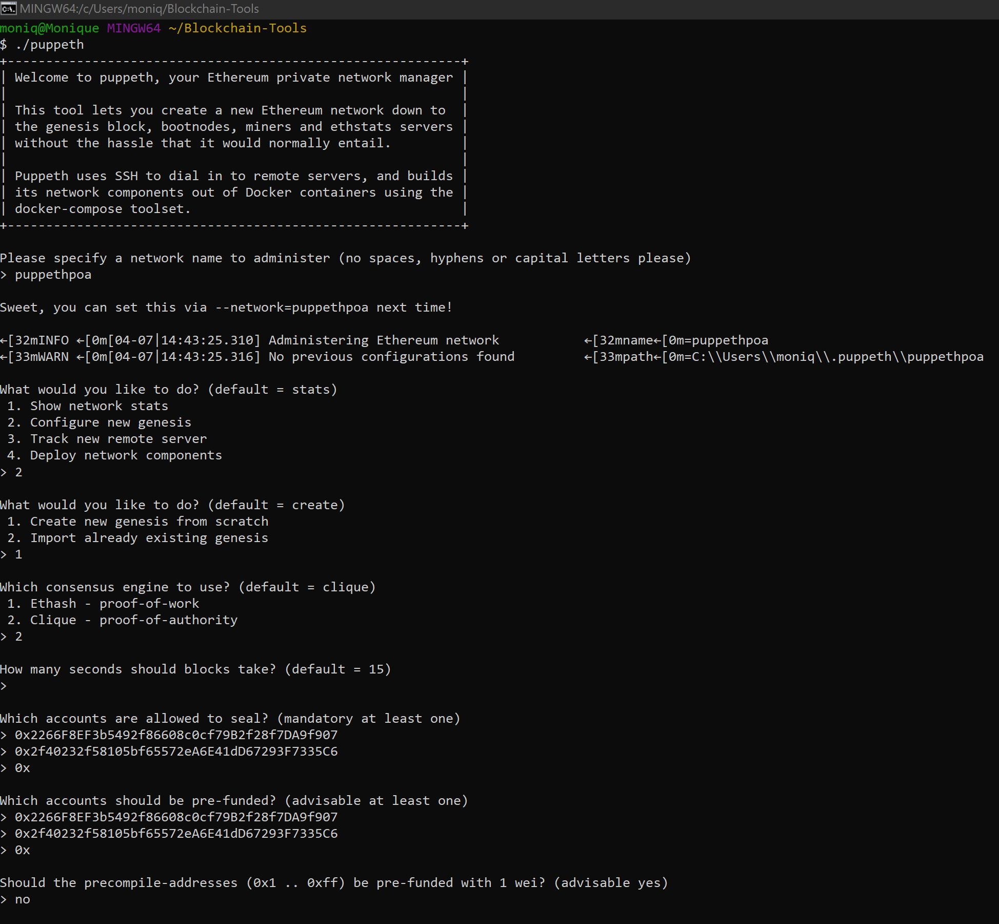
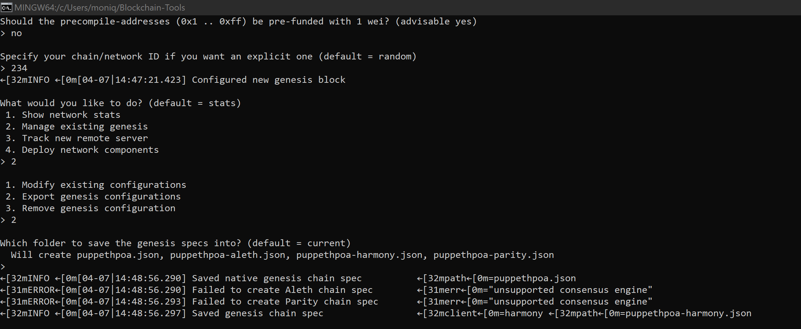
Before initializing and mining the nodes, the folder should contain the accounts created, puppeth, geth, and the json file.
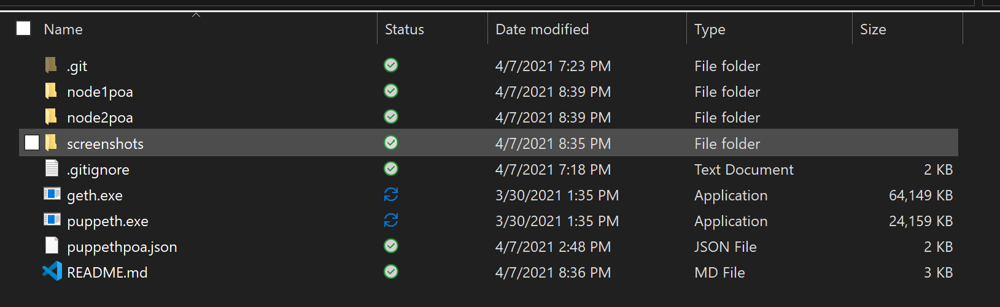
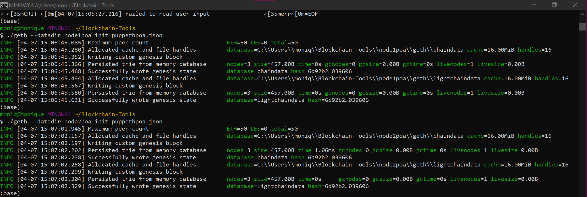
### Node 1 (node1poa)
* Address: 0x2266F8EF3b5492f86608c0cf79B2f28f7DA9f907
* Path of the secret key file: node1poa\keystore\UTC--2021-04-07T21-38-25.666655700Z--2266f8ef3b5492f86608c0cf79b2f28f7da9f907
* enode://aa4bfa876b951fbfbd7d0ed4a81efd49ca6f79dca7e6d21d169a3d8af657232841aabfa28a4804142d0bc1f68fe583c6dc02841c5521d581273c563695130b41@127.0.0.1:30303
    - This will be entered when preparing node2poa and links the accounts together.
* To Mine:
    
        ./geth --datadir node1poa --unlock "{node1poa-address}" --mine --rpc --allow-insecure-unlock
        
        password to enter: yellow

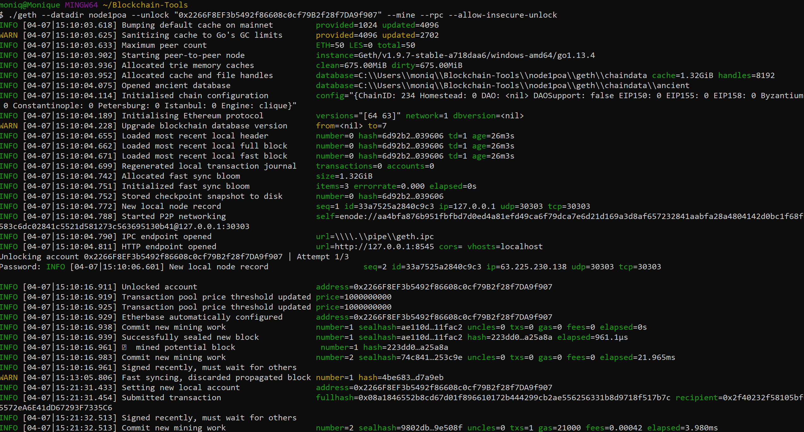
### Node 2 (node2poa)
* Address: 0x2f40232f58105bf65572eA6E41dD67293F7335C6
* Path of the secret key file: node2poa\keystore\UTC--2021-04-07T21-40-45.609789800Z--2f40232f58105bf65572ea6e41dd67293f7335c6
* To Mine:
    
        ./geth --datadir node2poa --unlock "{node2poa-address}" --mine --port 30304 --bootnodes "{node1poa-enode://}" --ipcdisable --allow-insecure-unlock
        
        password to enter: green

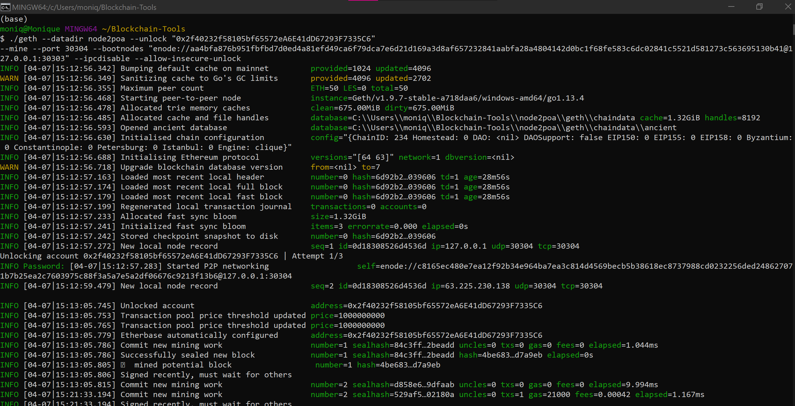
### MyCrypto
* Navigate to the '+ Add Custom Node' on the bottom left
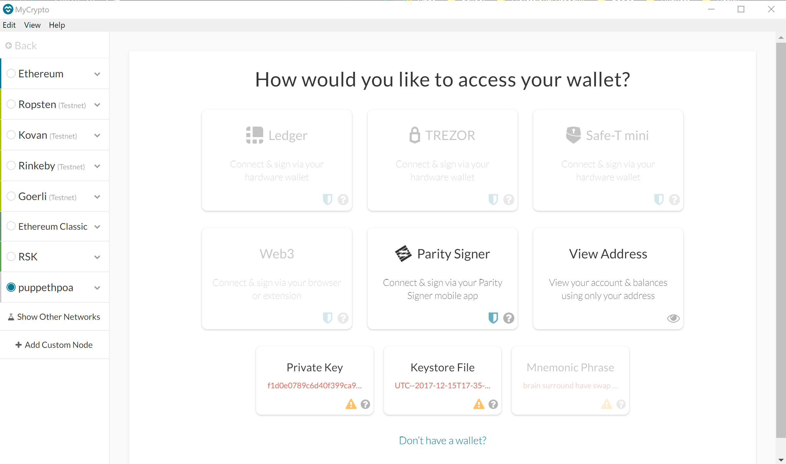
* Enter the required information in the screenshot below and click 'Save & Use Custom Node'
    - Node Name: puppethpoa
    - Network: Custom
    - Network Name: puppethpoa
    - Currency: ETH
    - Chain ID: 234
    - URL: http://127.0.0.1.8545/

    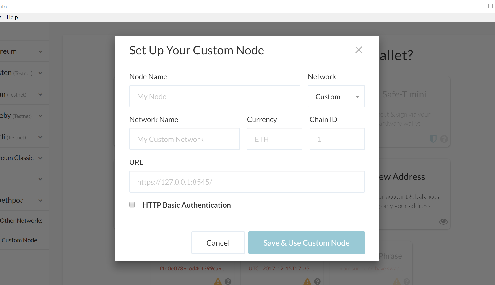
* Be sure that you are connected to the 'puppethpoa' network and click on the 'Keystore File' button to access the wallet
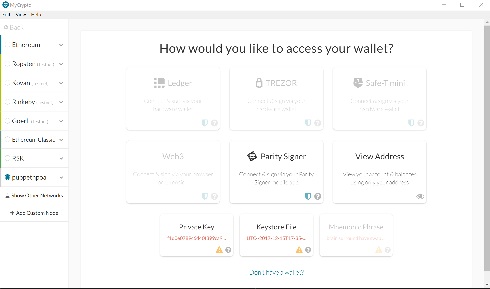
* Unlock the wallet by selecting the node1poa keystore file and enter the password: yellow
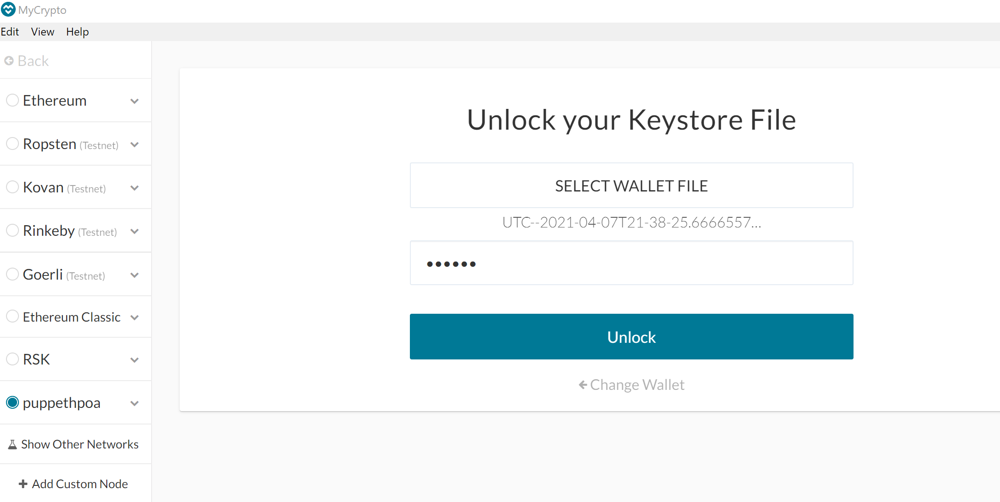
* To send a test transaction:
    - To Address: {node2poa-address}
    - Amount: {number of ETH}
    - Transaction Fee: using the sliding scale to choose preference
    
    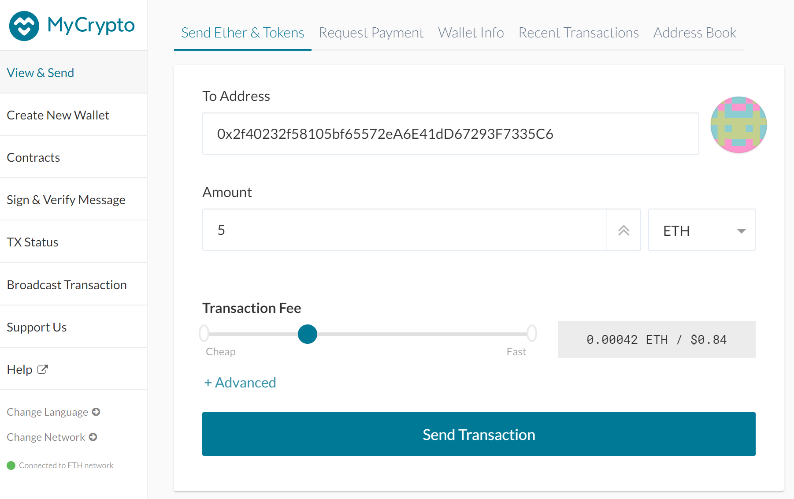

* Check transaction status by checking 'Recent Transactions' (alternatively you can copy the transaction hash and paste it into the 'TX Status' popup):
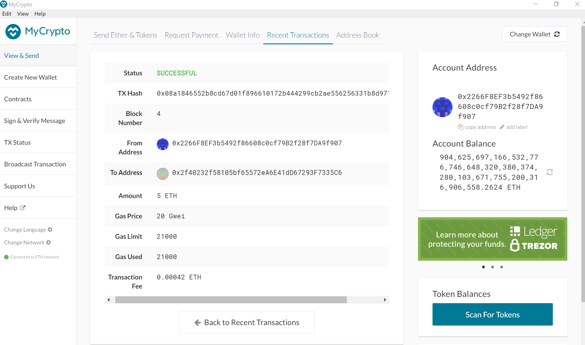
